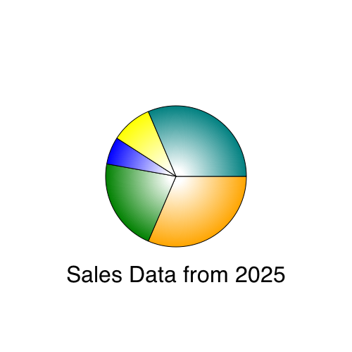

### Hands On: Making Charts

Note that you will load code directly from the local hard drive rather than
through a webserver. You may need to disable security in Chrome during
development because of this. If you are having issues with Chrome loading images
or other files directly from disk, try adding security flags to the command
line.

On Mac OS X this would be:

```
/Applications/Google\ Chrome.app/Contents/MacOS/Google\ Chrome --allow-file-access-from-files --disable-web-security
```

On Linux this would be:

```
chromium-browser --disable-web-security
```

On Windows this would be:

```
chrome.exe --disable-web-security
```

Alternatively, you can load the pages through a local webserver.


In this chapter we will graph some data by drawing a custom chart. You will
learn how to make basic lines, shapes, and text; then combine
them into a pie chart with a linear gradient.

## Create A New Page

Start by creating a new text file called `barchart.html` and type this in:

```
<html>
<body>
<canvas width="500" height="500" id="canvas"></canvas>
<script type='text/javascript'>

var data = [ 16, 68, 20, 30, 54 ];

</script>
</body>
</html>
```

The page above contains a `canvas` and `script` element. The canvas element is
the actual on-screen rectangle where the content will be drawn. The `width` and
`height` attributes determine how big the canvas will be. The Canvas is a block
level DOM element similar to a DIV so you can style it or position it just like
anything else in your page.

The `data` variable in the script tag is a set of data points that we will draw
in the bar chart.

Now let's get a reference to the canvas and fill the background with gray.
Add this to the script tag after the data variable.

```
//get a reference to the canvas
var canvas = document.getElementById('canvas');

//get a reference to the drawing context
var c = canvas.getContext('2d');

//draw
c.fillStyle = "gray";
c.fillRect(0,0,500,500);
```

## Drawing Data

Now you can draw some data.  Do this by looping over the `data` array. For each
data point fill in a rectangle with the x determined by the array index and the
height determined by the data value.

```
//draw data
c.fillStyle = 'blue';
for(var i=0; i<data.length; i++) {
    var dp = data[i];
    c.fillRect(25 + i*100, 30, 50, dp*5);
}
```

Now load this page up in your webbrowser. It should look like this:

.screenshot


The first problem is that the bars are coming down from the top instead  of the
bottom. Remember that the y axis is 0 at the top and increases as you go down.
To make the bars come up from the bottom change the y value to be calculated as
the height of the canvas (500) minus the height of the bar (dp*5) and then
subtract off an extra 30 to make it fit.

```
//draw data
c.fillStyle = 'blue';
for(var i=0; i<data.length; i++) {
    var dp = data[i];
    c.fillRect(25 + i*100, 500-dp*5 - 30 , 50, dp*5);
}
```

Now it looks like this:

.screenshot


## Axis Lines and Labels

Now add some axis lines by stroking a path starting at the top, down the left
side, and across the bottom.

```
//draw axis lines
c.fillStyle = 'black';
c.lineWidth = 2.0;
c.beginPath();
c.moveTo(30,10);
c.lineTo(30,460);
c.lineTo(490,460);
c.stroke();
```

Now add the value labels and tick marks down the left side.

```
//draw text and vertical lines
c.fillStyle = 'black';
for(var i=0; i<6; i++) {
    c.fillText((5-i)*20 + "",4, i*80+60);
    c.beginPath();
    c.moveTo(25,i*80+60);
    c.lineTo(30,i*80+60);
    c.stroke();
}
```

And finally add labels across the bottom for the first
five months of the year.

```
var labels = ["JAN","FEB","MAR","APR","MAY"];
//draw horiz text
for(var i=0; i<5; i++) {
    c.fillText(labels[i], 50+ i*100, 475);
}
```

The result looks like this:

.screenshot


Not bad, but there are a few tweaks we should make.  Let's change the
background to white so it doesn't seem to dreary, then adjust the
position of the bars slightly so they actually start at 0,0.


```
//draw background
c.fillStyle = "white";
c.fillRect(0,0,500,500);

//draw data
c.fillStyle = "blue";
for(var i=0; i<data.length; i++) {
    var dp = data[i];
    c.fillRect(40 + i*100, 460-dp*5 , 50, dp*5);
}
```

Now the final chart looks like this:


.screenshot


## Piechart

Now let's take the same data and draw it as a piechart instead.   The code is
very similar.

Create a new document called `piechart.html` containing this:

```
<html>
<body>
<canvas width="500" height="500" id="canvas"></canvas>
<script>
//initialize data set
var data = [ 100, 68, 20, 30, 100 ];

var canvas = document.getElementById('canvas');
var c = canvas.getContext('2d');
//draw background
c.fillStyle = "white";
c.fillRect(0,0,500,500);

</script>
</body>
</html>
```

Now add a list of colors (one for each data point) and calculate
the total value of all of the data.

```
//a list of colors
var colors = [ "orange", "green", "blue", "yellow", "teal"];

//calculate total of all data
var total = 0;
for(var i=0; i<data.length; i++) {
    total += data[i];
}
```

Drawing the actual pie slices seems complicated but it's actually pretty easy.
For each slice start at the center of the circle (250,250) then draw an arc from
the previous angle to the new angle. The `angle` is the portion of the pie this
data point represents, converted into radians. The `prevAngle` is the angle
from the previous time through the loop (starting at 0).  The arc is centered at
250,250 and has a radius of 100.  Then draw a line back to the center and fill
and stroke the shape.

```
//draw pie data
var prevAngle = 0;
for(var i=0; i<data.length; i++) {
    //fraction that this pieslice represents
    var fraction = data[i]/total;
    //calc starting angle
    var angle = prevAngle + fraction*Math.PI*2;

    //draw the pie slice
    c.fillStyle = colors[i];

    //create a path
    c.beginPath();
    c.moveTo(250,250);
    c.arc(250,250, 100, prevAngle, angle, false);
    c.lineTo(250,250);

    //fill it
    c.fill();

    //stroke it
    c.strokeStyle = "black";
    c.stroke();

    //update for next time through the loop
    prevAngle = angle;
}
```

Now finally add some text at below the graph. To center the text you must first
calculate the width of the text:

```
//draw centered text
c.fillStyle = "black";
c.font = "24pt sans-serif";
var text = "Sales Data from 2025";
var metrics = c.measureText(text);
c.fillText(text, 250-metrics.width/2, 400);
```

This is what it will look like:

.screenshot


## Add Some Gradients

To make the chart look a little bit snazzier you can fill each slice with a
radial gradient like this:

```
    //draw the pie slice
    //c.fillStyle = colors[i];

    //fill with a radial gradient
    var grad = c.createRadialGradient( 250,250, 10, 250,250, 100);
    grad.addColorStop(0,"white");
    grad.addColorStop(1,colors[i]);
    c.fillStyle = grad;
```

The gradient fills the slice going from white at the center to the color at the
edge, adding a bit more depth to the chart. It should look like this:

.screenshot


To make this chart more useful here are a few more improvements you could try making:

* Add data and change the math so that the barchart has 12 full months of data
* Build a line chart that draws each data point as a circle, then draw a multi-segment
line to connect all of the circles.
* Make the barchart prettier with gradient fills, rounded corners, or black outlines.
* Draw a label on each slice of the pie
