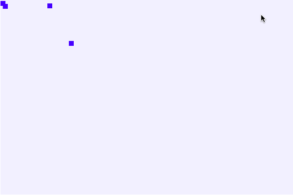
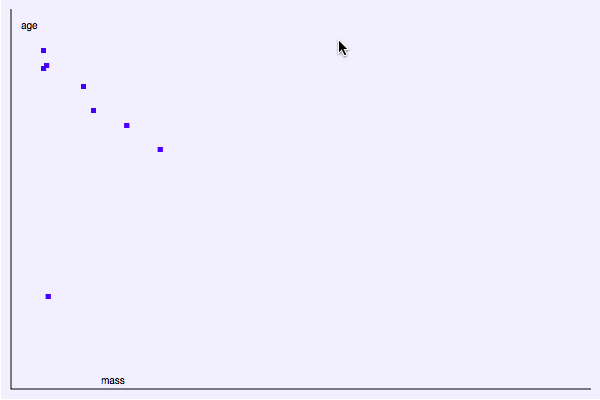
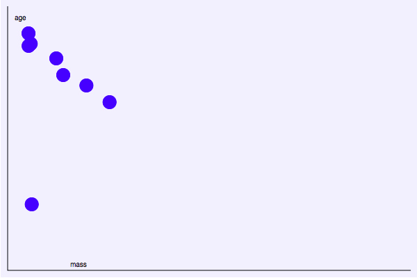
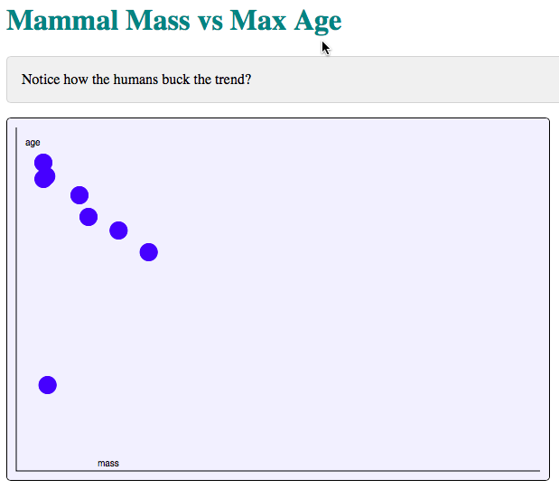

### HTML Canvas Intro / Lecture Part 1
## Josh Marinacci

Hi. Hello. Good morning. Thank you for joining me today at this early hour. We
are going to cover HTML canvas and some other web based graphics technologies. I
say _we_ because this isn't a solo endeavor. Please feel free to raise your hand
whenever you have a question, not just at the end. I'm sure plenty of things
won't be clear. This workshop is a work in progress.

I have done this workshop for the the fourth year now and each year I try to
make it new. There is so much to cover with web graphics that I couldn't cover
it all even if we had a 24 hour workshop, much less three.  This year we are
focusing on data visualization, but I put the material from the previous years
into an ebook called _HTML Canvas Deep Dive_, or now _HTML Graphics Deep Dive_
since the topic has grown to cover more than just Canvas. In this book we will
get deeper into what web graphics can do such as image manipulation, particle
simulators, and animation. Last year we covered video game development, so the
book also covers a bit of WebGL,  joystick input, webcams, and full audio
synthesis.

This year we are going to cover data visualization.  All of the material you
need is found on [my website here](http://joshondesign/p/book/html2014/) and
after the workshop is over this material will find it's way into the ebook as
well.

The workshop will be broken into alternating lectures and hands on sections.
First will will cover Canvas by hand and then SVG using D3. If we have time then
I have a 3rd lecture prepared on how to polish your visualizations and some
tools and libraries that can help.

So, welcome and enjoy.

## Data Visualization

Data visualization is just what it sounds like, visualizing data. _Making data
visual_. Fundamentally we are mapping data, usually numbers, into something
visual. We do this because humans are visual creatures. While we can read a
table of numbers we can't readily draw conclusions from it. The numbers are too
abstract. But if we transform those numbers into something visual, like the
rectangles of a bar chart, then we have converted the abstract into the
concrete. I can look at this simple chart and immediately tell that some values
are much bigger than others, and that the general trend is that the values
increase.

So all data visualization is just transforming abstract data into concrete
forms. We call this process mapping. I don't mean maps in the geographical
sense, but in the mathematical sense. Mapping is a function which transforms
from one set into  another.  For example,  I can map the first four integers
into multiples of three by using the _multiply by three_ function.

```
1
2
3
4
```

with the function

```
function(d) {
    return d * 3;
}
```

becomes

```
3
6
9
12
```

I could also map numbers into shapes. If the function was something like:

```
function(d) {
    return green rectangle with width of d
}
```

then the result would be


That's all that mapping is. Converting from one set of values, or _domain_ to
another using a mapping function.

In the olden days, before computers, this would be done by hand. There used to
be rooms full of humans literally called _computers_ who *computed*. They
hand calculated over and over to make big tables of numbers and draw pretty
charts. Today we have _digital_ computers which do the calculations for us.
Because computers are so fast we can create visualizations that would have been
impossible fifty years ago. And in recent years we've developed free software
tools, like HTML Canvas and SVG, that make this process easy and painless.

Before we actually draw something, let's see what technologies are available to
us. The web has a few graphics techs.

* Java Applets
* Flash
* DOM: Document Object Model
* Canvas
* SVG: Scalable Vector Graphics
* WebGL

We could use Java Applets or Flash, but these are browser plugins. They aren't
native to the browser and in recent years have become slow, buggy, and full of
security holes. Fortunately, we don't need to use them anymore.

The Document Object Model, or DOM, is the part of the browser that draws text
and boxes. Ultimately everything you see is part of the DOM, but it's not very
powerful on it's own. We can do great styled text and embed images, but that's
about it. The DOM is what most people think of when they talk about HTML and Web
content.

Next comes _Canvas_, which is the first technology we will work with today.
Canvas is fundamentally pixel based. The browser reserves a rectangular box in
the page for us to draw in. We can set individual pixels or use drawing
functions to fill in those pixels with shapes, text, and images. Once a pixel is
set it stays set until we change it. That's all Canvas does for us. Setting
pixels. If we want to do animation, or complex shapes, or user interaction; then
we have to do it ourselves with extra code. Canvas only knows about pixels. This
makes Canvas some what low level but very powerful and fast.

In the second lecture we will dive into Scalable Vector Graphics, or SVG. As the
name suggests SVG is all about vector graphics, or shapes. The browser reserves
a box in the page for our shapes. We put shapes into this box and the browser
will draw them for us. If we change some property of one of the shapes the
browser will redraw automatically.

The browser handles all of the shape interaction for us. We can animate the
shapes, style them with CSS, and even add event handlers directly on the shapes.
In this sense SVG is higher level than Canvas because it works at the shape
level rather than the pixel level.

There is a trade off of course. Because it is lower level, Canvas can do things
SVG can't, but at the cost of more code. We can't set individual pixels or edit
images with SVG, and historically SVG was slower than Canvas and not supported
in all browser. These days, however, SVG is fast enough and works pretty much
everywhere, so the choice really comes down to which API makes sense for your
task. If you are doing something more pixel-ish, then go with Canvas. If you are
doing something with lots of shapes, go with SVG.


## Drawing with Canvas

Okay. Enough theory. Now let's dig into Canvas and actually draw something.

Suppose we have a bunch of data points of mammal age in years vs body mass in
kilograms (I've made up these numbers).

```
<script type='text/javascript'>
var data = [
    { name: 'tiger', age: 23, mass:  1500  },
    { name: 'lion',  age: 28, mass:  2500  },
    { name: 'rat',   age: 3,  mass:  0.13  },
    { name: 'cat',   age: 9,  mass:  4.8   },
    { name: 'deer',  age: 8,  mass:  96    },
    { name: 'cow',   age: 15, mass:  1200  },
    { name: 'elephant', age: 36, mass: 3500 },
    { name: 'human', age: 85, mass: 140 },
]
</script>
```

Lets set up our canvas and fill the background.

```
<html>
<body>
<canvas id='chart' width='600' height='400'></canvas>
<script>
var chart = document.getElementById('chart');
var ctx   = chart.getContext('2d');
var w = 600;
var h = 400;
ctx.fillStyle = '#f0f0ff';
ctx.fillRect(0,0,w,h);
</script>
</body>
</html>
```

To draw our chart we just loop over the data, drawing a rectangle at each point.

```
for(var i=0; i<data.length; i++) {
    var mammal = data[i];
    ctx.fillStyle = '#0000ff';
    ctx.fillRect(
        mammal.mass, // x coordinate
        mammal.age, // y coordinate,
        10, //height
        10 //width
        )
}
```

And it looks like this.

.screenshot

Hmm. That doesn't look so good. Most of our values are off the edge. We need
to scale the data down and move it over a bit

```
ctx.fillRect(
    mammal.mass / 30 + 40,
    mammal.age*3 + 40,
    5,
    5
    )
```

Okay. That's better. We can at least see it all now. Next, let's add some text
and lines for the axes.

.screenshot

```
ctx.beginPath();
ctx.moveTo(10,10);
ctx.lineTo(10,390);
ctx.lineTo(590,390);
ctx.stroke();

ctx.fillStyle = 'black';
ctx.fillText('age',20,30);
ctx.fillText('mass',100,385);
```

.screenshot

A few things to note: first, the coordinate system increases from left to right
for the x axis, but goes from top to bottom in the y direction, unlike regular math.
This is the standard for computer graphics for historical reasons, so we have
to deal with it.

We draw text just like the rectangles with `fillText()` then the string to draw
and where to draw it. Notice that text is drawn at the baseline. If we drew it
at 0x0, which is the upper left, we it would be drawn off the top. We need to
add a few more pixels to bring it down.

Lines are drawn using paths. Canvas doesn't really know about any particular shapes,
just paths composed of straight lines, arcs, and bezier curves. For example, if
we want to draw circles instead of rectangles we would have to make our own
circle function like this.


```
function circle(ctx, cx, cy, radius) {
    ctx.beginPath();
    ctx.arc(cx,cy,radius,0,Math.PI*2, false);
    ctx.fill();
}
```




So there is our chart. Let's add some explanatory text around it, styled in the
usual web way with CSS.

```
<h1>Mammal Mass vs Max Age</h1>
<p>Notice how the humans buck the trend?</p>

<style type='text/css'>
    h1 { color: teal; }
    p {
        background-color: #f0f0f0;
        color: black;
        border: 1px solid lightGray;
        border-radius: 5px;
        padding: 1em;
    }
    canvas {
        border: 1px solid black;
        border-radius: 5px;
    }
</style>
```

which looks like this:

.screenshot

So that is the basics of canvas. You get a context, set the fill color, then
draw your shapes. Simple and fast.  Now let's switch to the hands on. In this
hands on you'll use canvas to build a bar chart and pie chart from scratch.

You will need a text editor and a webbrowser. I suggest using Chrome because it
has great dev tools and works the same on all platforms.
