### Bluetooth Low Energy
##  Big Progress for Small Consumption

Josh Marinacci

Advanced Technologies, Nokia

---

### 5 Minute summary of wireless technology

@note Here we go. in 5 minutes or less, everything you ever needed to know
about wireless technology for mobile devices


---

### In The Beginning


---

## Infra Red

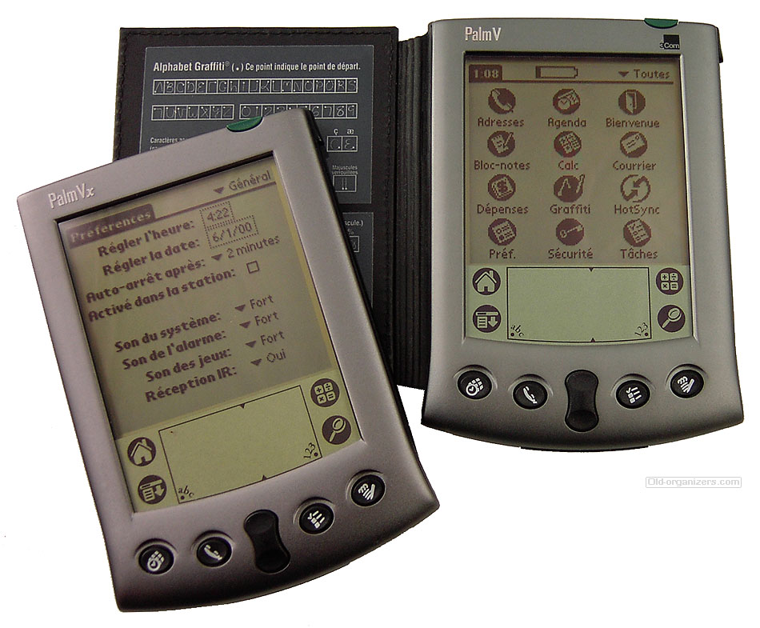

@note Infrared was the cheapest and easiest way to transmit data between mobile
battery powered devices. It was awesome except it was slow and required line of
sight. But you could transfer phone contacts, so that was cool.

@note http://en.wikipedia.org/wiki/Infrared#Communications


---

### Bluetooth 1994


* Bluetooth 1.0 (1994) 0.7 Mb
* Bluetooth 2.0 (2004) 3.0 Mb
* Bluetooth 3.0 (2009) 24 Mb (by cheating w/ WiFi)


@note http://en.wikipedia.org/wiki/Bluetooth

@note Next up came Bluetooth (1994), which didn't require line of sight and was
faster, but cost a lot more and killed your battery life. And the specs were
very complicated. But it did let you connect your phone's address book to your
car and make voice calls. It could also do other cool things like transfer files
assuming your carrier wasn't Verizon who blocked it. It's been updated over the
years with more features and speeds, but essentially the same.


---

### RFID

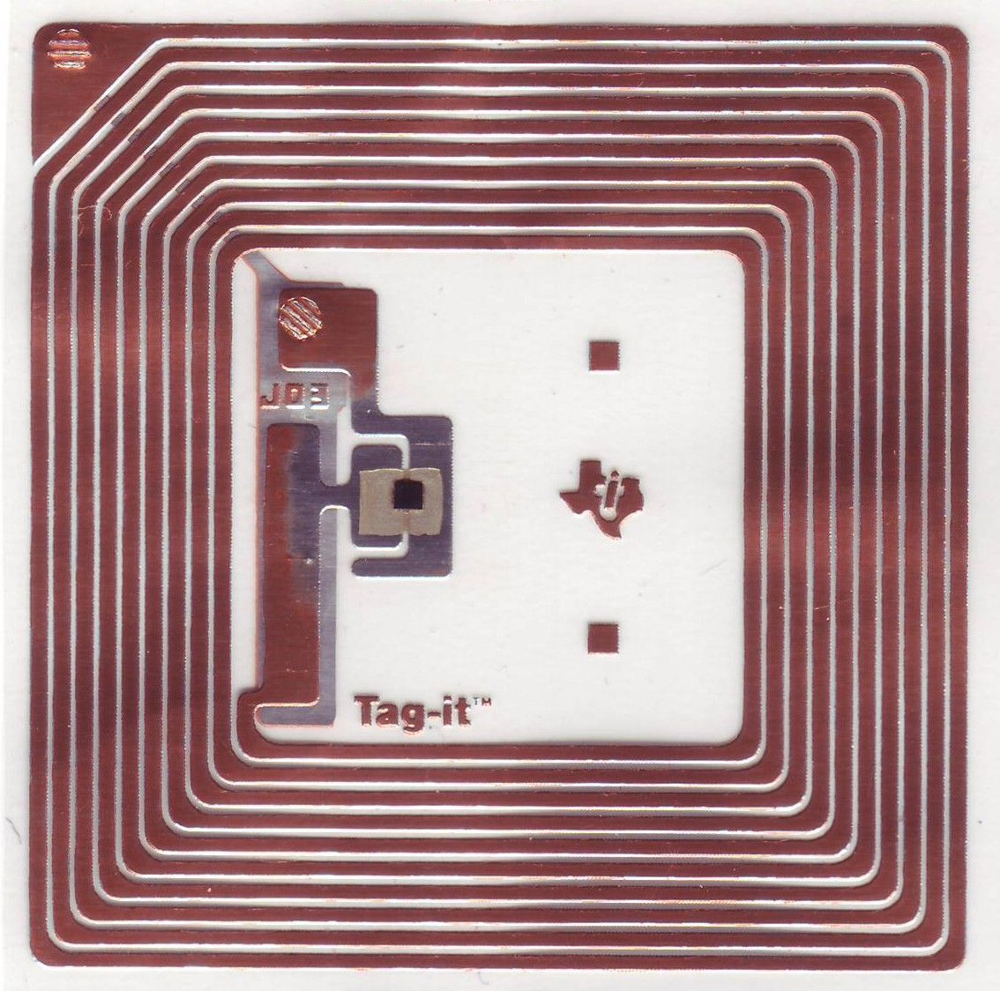

## mid 90s: one way barcode

@note http://news.bbc.co.uk/2/hi/uk_news/england/bristol/somerset/8011998.stm

@note http://en.wikipedia.org/wiki/RFID

@note Next came no-contact wireless communication, powered or unpowered. a few meters
to 100s of meters if powered. low data rate. essentially wireless barcodes. they
are getting smaller and cheaper.

---

###  NFC:


## 2004: two way barcodes


@note http://en.wikipedia.org/wiki/Near_field_communication

@note NFC is fancier with two way communication, Mainly used in commerce applications.
Notably, Apple devices do not support it, but Google has really pushed it.


---

### WiFi


@note WiFi is fast, but it's overkill fast. And that means it sucks power. It's
okay for something like a smartphone, but not good for tiny coincell powered
devices. Also, you've got the whole login problem.

---

### Why Do They Suck?

## But they do!


@note What is wrong with these? Why did we need something better.  For a lot of
use cases you don't need high speed, but you do need very low power consumption
while still being two way, but without requiring line of sight. And we want
something that works on every mobile OS, and that doesn't require being a part
of some special developer program. That's what Bluetooth Low Energy gives us.


---

### Why Do They Suck?

* too expensive
* consume too much power
* not supported on every mobile device


---

### Bluetooth 4.0
## 2010: Bluetooth Low Energy

@note Finally we get to Bluetooth 4.0 (2010). Everything in BT 3.0 + Bluetooth
Low Energy (also called Bluetooth Smart).  BT4.0 mandates the BLE part, so
basically everything coming out today has BLE support out of the box. Most
laptops and desktops, Win Phone, iOS, Android. It's everywhere. Today I'm going to talk just about Bluetooth Low Energy and why it's
awesome.


---

### BLE: Bluetooth Low Energy

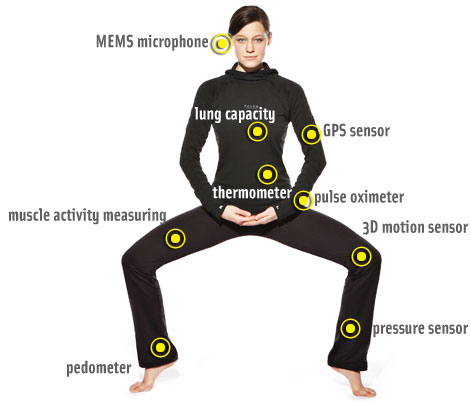

* http://en.wikipedia.org/wiki/Bluetooth_low_energy

@note As the name would suggest, Bluetooth Low Energy is designed around using
very little power.  It can be used all the time on your phone without killing
your battery. It can be used with embedded sensors that last up to a year on
a single battery.


---

### BT != BLE

@note It's important to understand that Bluetooth Low Energy really has nothing
to do with regular Bluetooth. It was originally developed by Nokia as
under the name Wibree. The Bluetooth Special Interest group adopted it
and cleaned it up, then renamed it BLE.  Some devices support both ble and
classic, some just support BLE. If you buy a breakout board for your arduino
it will probably support one or the other but not both.


---


### Design

* same frequencies as BT
* key value pairs, no streams
* profiles
* low bandwidth, 5-10kbs

@note BT guys had to design a very different kind of protocol. While it does use
the same frequencies. Not streams. Keyval pairs. Characteristics. Grouped into
sets called profiles. It is these profiles that let you communicate between
devices. Very low bandwidth, on the order of 5-10kps. Power savings is the most
important feature. You really can make a device that will run for a year on a
coin cell battery.


---

### Let's Build Something!


@note Okay, cool. So we're ready to go, right? Just get some little Arduino
boards and we can start talking to our phones? Well... it's not quite so easy.
In fact, a year ago there were almost no options for cheaply hooking up BLE
to your Arduino project, and phone support was buggy or non-existant.

---

### Last Year

* hard to code
* two boards
* iPhone only
* few computers

@note Chips are cheap, but not easy to work with. Be a real embedded systems
programmer. Need expensive tools and compilers. A year ago there was only one or
two Arduino compatible boards for BLE. They were limited in features and very
expensive. Poor phone support. iPhone 4s only, iOS 6 buggy. Non-standard Android
APIs. No Winphone, even w/ Nokia Lumia hardware.


---

### This Year

* tons of boards
* all iDevices, Android 4.3+, WinPhone 8+
* great libraries
* most computers, 20$ dongles

@note Today life in the BLE world is so much better. Tons of Arduino compatible
boards. Price going down. All smartphones. iOS 7 has very good  support, all
Apple devices have it built in, even their desktops. With JellyBean Android
supports it. With Windows Phone 8.1 those Lumia devices support it. We did that.
There is also pretty good Mac and Win 8 support it. You can even run it on a
Raspberry Pi with a cheap dongle from Amazon.


---

### Next Year


* every device, ever


@note Pretty much everywhere. Since it's built into the 4.0 BT spec pretty much every
smart device is going to get it. And since the chips are cheap, pretty much
every dumb device will use it as it's communication system. Thermostats, heart
rate sensors, you name it it'll have BLE in it.


---
###  Arduino Now


* Arduino shields & breakout boards
* BLE built in: Arduino compatible
* USB adapters: desktop & Raspberry Pi
* Most compatible w/ non-Arduino too.

@note When I say Arduino, I really mean most embedded computers. Arduino is just
the most accessible. So what can you buy today for Arduino development? A lot,
actually.  There's a ton of shields and devices available for under 50 bucks,
some significantly under. I'll break them into three categories.

---

### Shields

@note things which attach to an existing Arduino boards. Meaning they can't do
anything on their own. Some are actual Arduino Shields, certain size and pin layout.
Some are breakout boards you can wire up to anything.

---

### Adafruit: Bluefruit


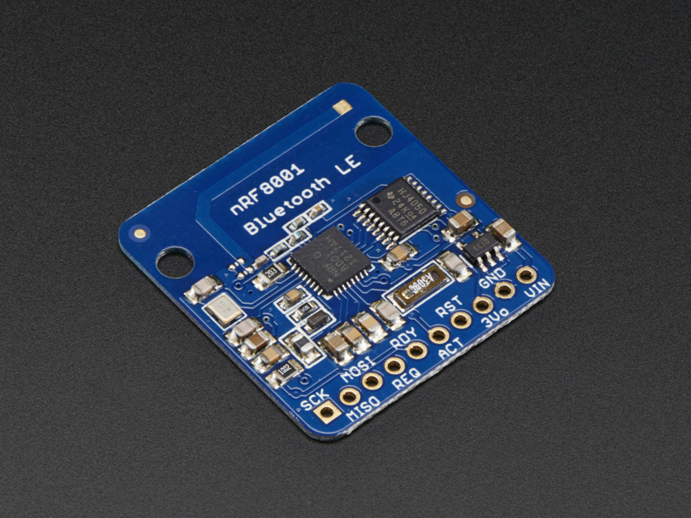

# https://www.adafruit.com/products/1697

@note Got one. Not played yet. Typical Adafruit fashion, small, good price, very
well documented, hackable. One of their guys wrote the new O'Reilly BLE book.

---

### Dr Kroll: BLE Shield

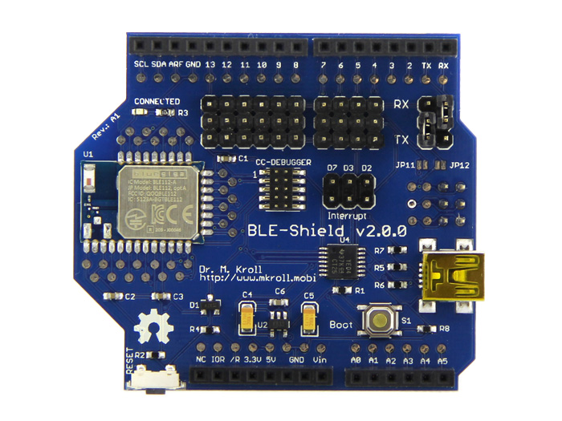

# http://www.mkroll.mobi/?page_id=386

@note A bit more expensive but uses BlueGiga chip, so more flexible. Explain later
why BlueGiga is important. Actual shield

---

### Red Bear Labs

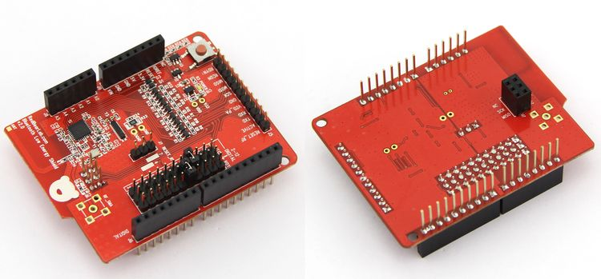

# http://redbearlab.com/bleshield/

@note they have several versions with different features. This one is
actual shield formfactor. Others smaller.

---
### Tiny Circuits

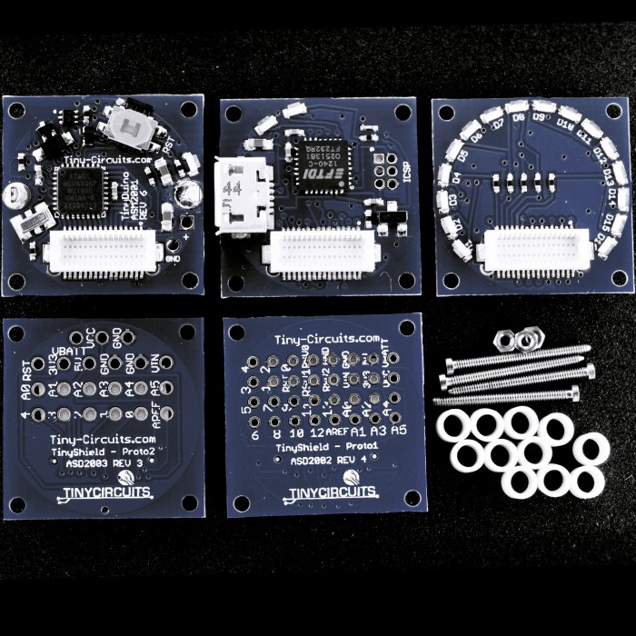

# https://tiny-circuits.com

@note a line of tiny boards, stack them to build what you need.

---

### SeeedStudio Xadow

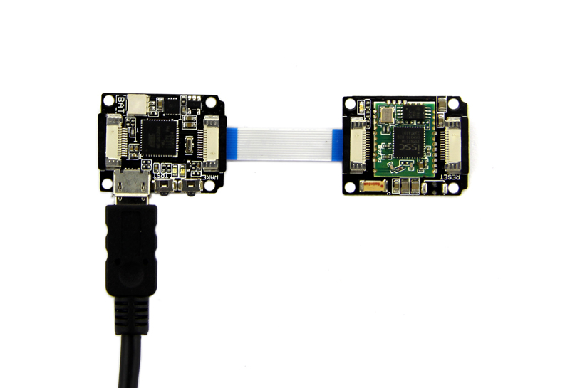

# http://www.seeedstudio.com/depot/Xadow-BLE-p-1727.html

@note a line of tiny boards, hook up what you need. targeting wearables.
I love these. Docs aren't great but the hardware is amazing. I'm working
on better docs and libs. 20$ = tiny leo board + lipo + charger. Other boards

---

### CPU + BLE

---

### RFDuino

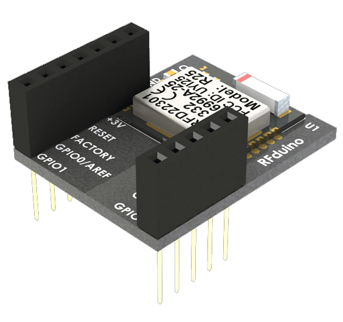

# http://www.rfduino.com

@note I don't recommend this one. Not because the product is bad but because
they've not been very responsive with their support or forthcoming with open
source code. Give them time to sort things out.

---

### BlendMicro

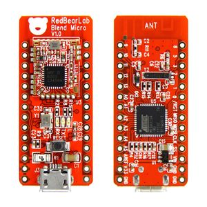

# http://redbearlab.com/blendmicro/

@note blends an AVR based Arduino with the Nordic BLE chip

---


### Bean

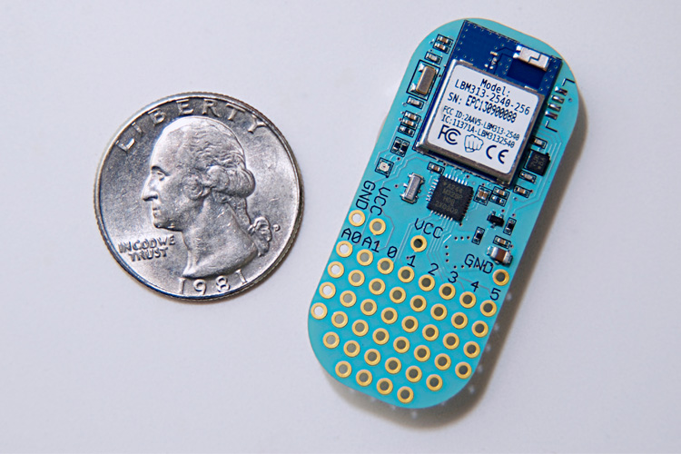

# http://punchthrough.com

@note My new fav. I have one to pass around. Built in proto spaces, RGB LED,
accelerometer, and temp sensor.

---

### List of USB dongles


---

### Pluggable BLE Adapter

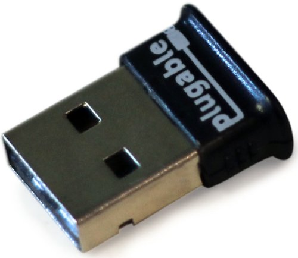

@note Too many to mention. Mention this one because it worked out of the box
on Raspberry pi.


---

### Simple Arduino Demo

```
BTLEserial.pollACI();
aci_evt_opcode_t status = BTLEserial.getState();
if (status == ACI_EVT_DEVICE_STARTED) {
    //advertising started
}
if (status == ACI_EVT_CONNECTED) {
    //someone connected

    //write some data
    BTLEserial.write(sendbuffer, sendbuffersize);
}


```

@note I mentioned that BLE uses key value pairs, characteristics. These are
powerful but complicated to use at runtime from an Arduino. Most use serial port
profile. A few extra stuff for putting device into discovery mode so phoen can
connect, then just serial.

---

### Robot!

@note To show how this works I've put together a simple robot using an Arduino
Uno, the Red Bear Labs BLE shield, and a 2WD robot chassis from DF Robots. You
can see that I stacked the shields on to the Uno, then screwed it into the
robot. The Arduino code is extremely simple. It just accepts simple commands to
start and stop the motors.

```
setup() {
    cmdInit(&ble);
    cmdAdd("left", left);
    cmdAdd("right", right);
    ...

}
void left(int arg_cnt, char **args) {
    L->run(FORWARD);
    delay(200);
    L->run(RELEASE);
}
void right(int arg_cnt, char **args) {
    R->run(FORWARD);
    delay(200);
    R->run(RELEASE);
}
```

---

### Red Bear App

@note on the phone side I wrote a simple iOS app. It uses the Red Bear iOS library
to communicate. When I click a button it sends the command.

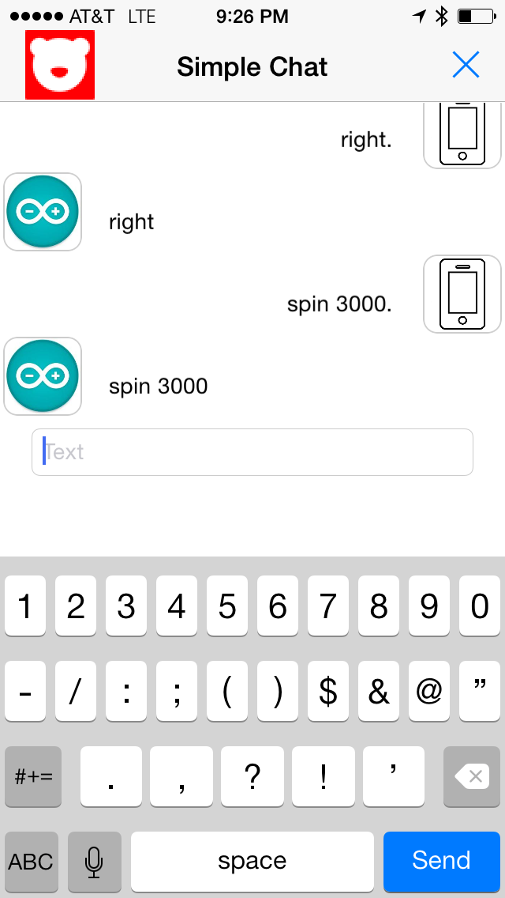

---

### Robot Demo

---

### Lessons Learned

* prefab apps are limiting, but easy
* BLE is interference prone
* check your pin docs

@note I learned a few lessons from this project. First, using the prefab apps is
limiting, but it's quite fast for prototyping purposes. Second, BLE can very
easily be overwhelmed by interference; and not just from other RF. I got tons of
noise from the motor driver shield. I ended up having to move it to the side and
wire it up by hand instead of stacking it. Also, when you use multiple shields,
look up which pins they all use. I found that the docs may not be complete. For
example, the BLE shield uses several control pins, but also the SPI bus, which I
has it's own pins.


---

### More Mobile, Less Power

@note So this is pretty cool, but I could already do this with a physical serial
cable. The only difference is the lack of wires. Which, with a mobile robot, is
really important. But what about something that really needs the low power, like
a smartwatch. Here's a quick one I built using the Xadow system from
Seeedstudio.


---


### Xadow Modules

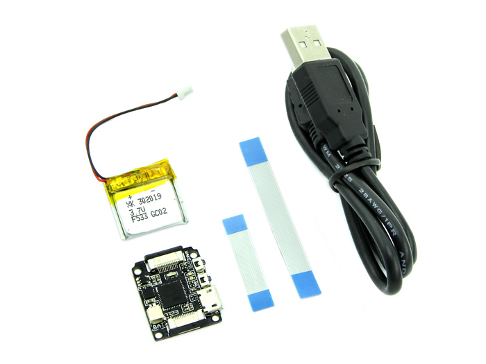

@note Xadow is a system of tiny modules that connect using an I2C bus over a
flexible ribbon cable. The main module is basically an arduino leonardo with a
built in lipo charger circuit and a lipo battery, all for twenty bucks.  You
then buy modules for the features you want to add, like an LED grid, an accelerometer,
and of course a bluetooth LE module.


---

### Smart Watch

# Demo

photo of  smartwatch

photo of custom ios app


@note Xadow's BLE module works the same way as the Red Bear one. It emulates a serial
port over BLE.  I've built a simple one here in a 3d printed case which can talk
to my phone. From the phone I can set the current time, set an alarm, and send
simple messages. It can also tell me the current battery state. What it can't do
is be made aware of system wide messages on my phone. If i get a facebook or
twitter notification I can't send it to my smart watch. Why is that?

---

### Serial is Limiting

* no iBeacon
* no Apple Notification Center Service
* more power than necessary

@note So now we get into one of the big problems with BLE today. All of these
Arduino compatible devices use a serial profile to emulate a regular serial
port. While it does make it easy to code, it's not as power efficient as a
proper BLE profile. It also doesn't let you access platform specific profiles.
On iOS Apple implemented a  new profile called Apple Notification Center
Service, or ANCS. This provides system wide access to notifications, but to use
it your BLE device must support custom profiles.  Most of the Arduino boards do
not.

---

### Custom BLE is Hard

* SOCs
* expensive compilers
* proprietary SDKs

@note It turns out that supporting custom profiles is rather difficult. The chips
themselves have some roadblocks, which is why it's been hard to do BLE until
the recent boards I've shown you.

---

### SOC Options

* Texas Instruments
* Nordic
* BlueGiga (sorta)
* Bean (sorta)

@note There is really only about two different underlying BLE chips. One from TI
and one from Nordic. Every board you find will be built on top of one of these.
These chips have to be reprogrammed to support different profiles.

---


### TI CC2540

* 4000$ compiler!
* Win only

@note The TI chip is an SOC. System on Chip. Means it has a CPU. In theory you would't
need an Arduino at all, but you have to use a 4000$ compiler to program it. In
practice a board using this chip will be pre-programmed with the one serial
profile the board maker supports, then wired to the Arduino through pins.

---

### Nordic nRF8001

* 100$ compiler
* Win only
* Mac/Linux emulation possible
* Embracing Arduino

@note Nordic chip is Similar. Compiler is free or comes with 100$ SDK. Compiler ,
though at least their windows only compiler is free with their 100$ SDK. Again,
the board you get is probably pre-programed to support one profile. On the plus
side, Nordic embracing Arduion. Making more code, docs available. If you have
the choice get device based on Nordic. Gives you option to reflash it.

---

### Apple Notification Center Service

* Not trivial
* reverse direction

@note To support a new profile like ANCS you'd need to dig into the internals of the BLE
chip and write your own support. Not for the timid. That's why almost every
board uses a serial port profile. But, all is not lost. Things are getting better.

---


### BlueGiga

* TI Chip
* New BLE stack
* XML + BGScript
* free compiler (win only)

@note Some boards are built on BlueGiga chips. While BG uses the TI chip underneath
they wrote their own BLE system from scratch. The compiler is free , though
windows only.  You can define new profiles using XML and their BG Script
language. I found an ANCS implementation on github here and was able to
make an LED blink when a tweet came in.

---

### Punch Through Bean

* Nordic Chip
* New BLE Stack
* No new SDK, just use Arduino
* Will sell you just chips

---

### Board Maker Support

* Dr. Kroll BLE Shield
* Red Bear Labs
* Bean (eventually)
* RFDuino (manual reflash)

# http://www.mkroll.mobi/?p=1613

@note And another option is to buy a board where the manufacturer has done the
hard work of creating a custom profile for you. Dr. Kroll have
provided alternative firmware for ANCS and iBeacon support. Some 3rd parties
have done ANCS support for Red Bear and others. In general, only boards based
on Nordic or BlueGiga chips are like this.


---

### Reflash it yourself

@note And finally, you can reprogram the board yourself. The nordic SDK isn't
that hard to use and there have been some recent efforts to better document the
process.  All in all BLE is getting better and easier to use.

---

### Next Steps

---

### One Serial Profile

Too many profiles. They do the same thing!

@note One thing I'd like to mention is that almost every board uses their own
serial port profile and implementation. This is a lot of duplicated effort. I'm
trying to work with some of the BLE board vendors to create a standard serial
profile that we all could share. please contact me for more info.

---

## Getting Started with Bluetooth LE
# Tools and Techniques for Low-Power Networking

Kevin Townsend, Carles Cufí, Akiba, Robert Davidson


@note If you are serial about BLE you need this book. Just came out
last week. Very in depth. Covers high level apis and low level
details.

---

### Electron IDE

# www.electron.pw

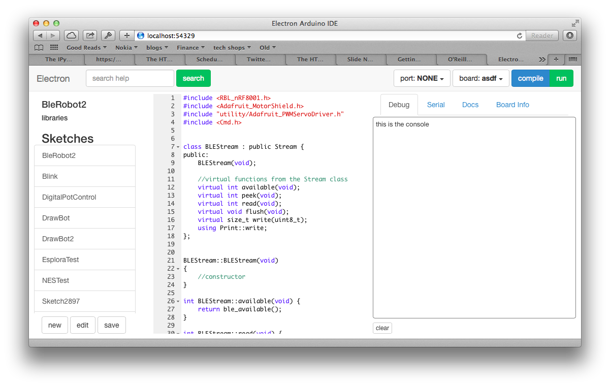

@note In general Arduino is still too hard to use on the software side, and BLE
adds to the complexity. My new open source IDE. Modern editor. Installs libs
and binary packages for you. Eventually inline documentation, Firmata, BLE
support. Have a bof tonight at 8.

---

### Le Fin

* joshondesign.com
* www.electron.pw
* learn.adafruit.com
* joshua@marinacci.org
* @joshmarinacci
